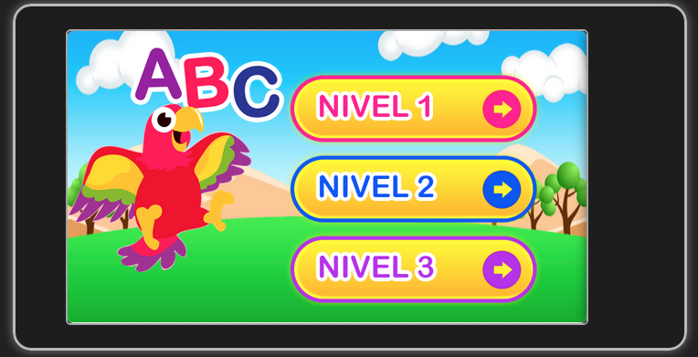

# abc-app
Application for divice mobile subject : Alphabet for kids (alphabet game)
Project development in Html,css

## Description : Mauricio Vargas

Estas son las palabras que tenemos: http://develowebapps.com/apps/abc/palabras.jpg

cada letra tiene 3 palabras asociadas ( 1 por nivel). Por favor acomoda según tu criterio la palabra más facil en el nivel 1 y la más complicada en el 3. (p. ej:  A: Arbol (nivel 1), Arbol (Nivel 2), Alpaca (Nivel 3) )

solo la X tiene 1 sola palabra, así que se repite en los 3 niveles.

 

Por favor, en el PSD con las palabras solo utiliza la imagen y la letra, Ya no va la palabra, ya que en el juego se le muestran 4 palabras para que elija la adecuada.

Por favor también a tu criterio elige las otras 3 palabras que se mostrarán al niño. Todas empiezan con la misma letra. Ten en cuenta que lis niños tienen de 4 a 6 años, así que busca palabras sencillas.

## Resources
generate icono support Android IOS

https://github.com/AlexDisler/cordova-icon

http://www.phpjabbers.com/javascript-countdown-timer-php46.html

Resource for sound native

https://github.com/cfjedimaster/Cordova-Examples

## Cordova plugin Requeriments

    # 01 add plugin for sound 'MEDIA'
    cordova plugin add org.apache.cordova.media
    cordova plugin add org.apache.cordova.device
    
    # 02 add plugin for splashcreen ()
    cordova plugin add org.apache.cordova.splashscreen

    # 03 open in browser
    cordova plugin add org.apache.cordova.inappbrowser

## config developer

Install: for Sound
    cordova plugin add org.apache.cordova.media
    cordova plugin add org.apache.cordova.device

Install: for Icon
https://github.com/AlexDisler/cordova-icon (OK)

Install: for spash screen
https://github.com/AlexDisler/cordova-splash (OK)
    
    cordova plugin add org.apache.cordova.splashscreen

    config: config.xml
    
    <?xml version='1.0' encoding='utf-8'?>
    <widget id="com.example.appabc" version="0.0.1" xmlns="http://www.w3.org/ns/widgets" xmlns:cdv="http://cordova.apache.org/ns/1.0">
        <name>AppAbc</name>
        <description>
            A sample Apache Cordova application that responds to the deviceready event.
        </description>
        <author email="dev@cordova.apache.org" href="http://cordova.io">
            Apache Cordova Team
        </author>
        <content src="index.html" />
        <access origin="*" />
        
        <preference name="SplashScreen" value="screen" />
        <preference name="SplashScreenDelay" value="3000" />

        <preference name="exit-on-suspend" value="false"/>
    </widget>

Screenshot reference

## OJOoooooo :D
- dar permisos a los sonidos chmod 777 * (para lectura app)

## 
Position div INDEX (assets/css/style.css)
.img-main-alphabet          = O      # imagen del abecedario (center)
#popup-message-win-points   = 1      # message score (center)
.popup-restart              = 3      # button restart(rigth)
.content-footer             = 4      # footer buttom

## Support Responsive

Support responsive device with min : 300px

